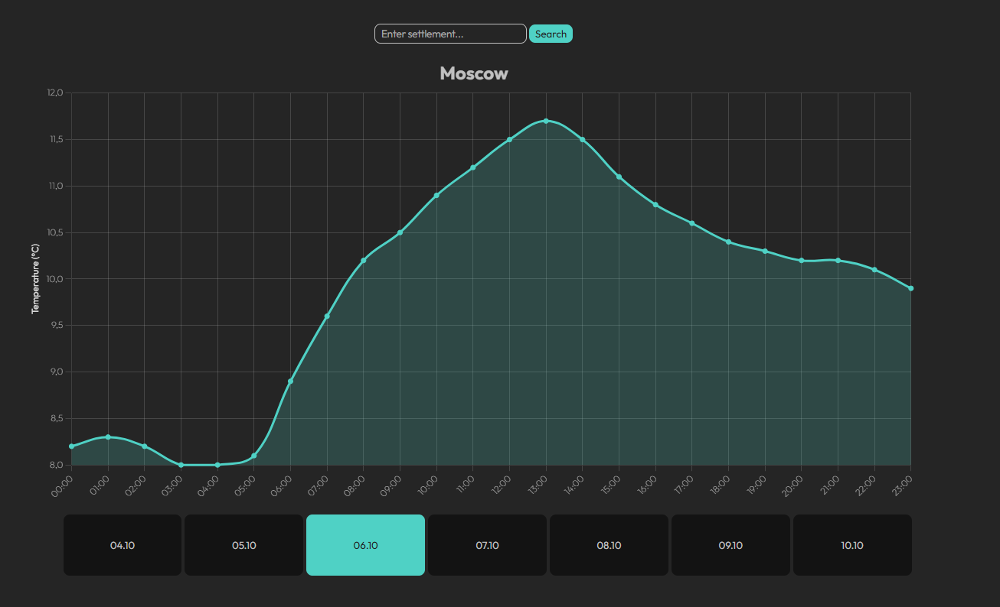

# Weather App

Веб-приложение для отображения прогноза погоды с графиками.  
Использует [Open-Meteo API](https://open-meteo.com/) для получения данных о погоде и визуализирует их с помощью [Chart.js](https://www.chartjs.org/).

## ✨ Возможности

- 🌡️ Получение прогноза температуры по дням и часам  
- 📊 Визуализация данных в виде красивых графиков  
- 📅 Автоматическая группировка значений по дням  
- ⚡ Кэширование через встроенный Redis (поднимается внутри Node.js, без ручного запуска) 


## 📷 Демонстрация



## 🚀 Установка и запуск

1. Клонируйте репозиторий
```bash
git clone https://github.com/acidless/weather-app.git
cd weather-app
```
2. Установите зависимости
```bash
npm install
```
3. Вы можете настроить окружение, создав файл .env в корне проекта<br>
Параметры окружения по умолчанию:
```.env
PORT=3000
CACHE_MINS=15
```
4. Запуск сервера
```bash
npm start
```

## 📜 Лицензия
MIT License © 2025

